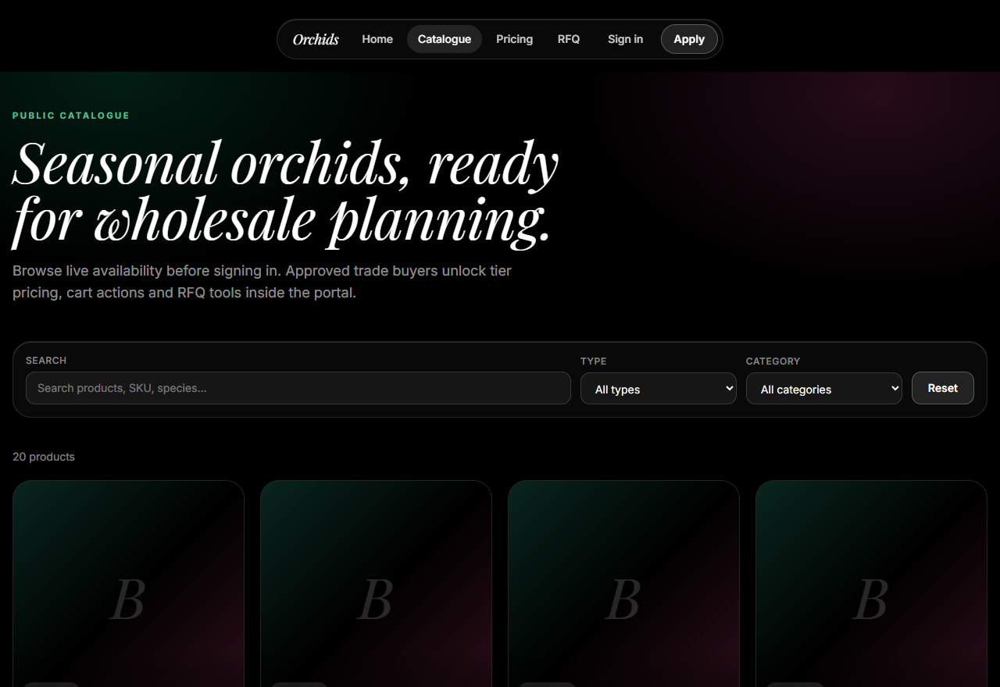
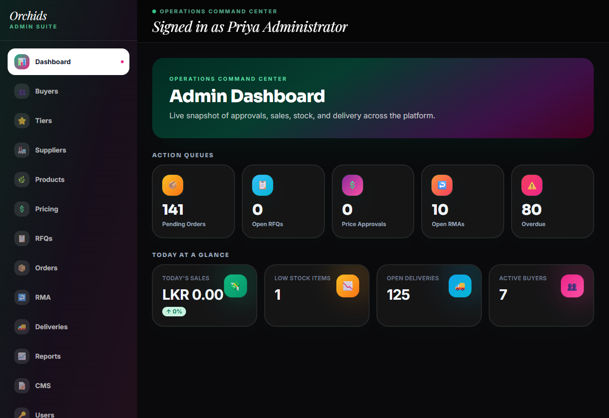
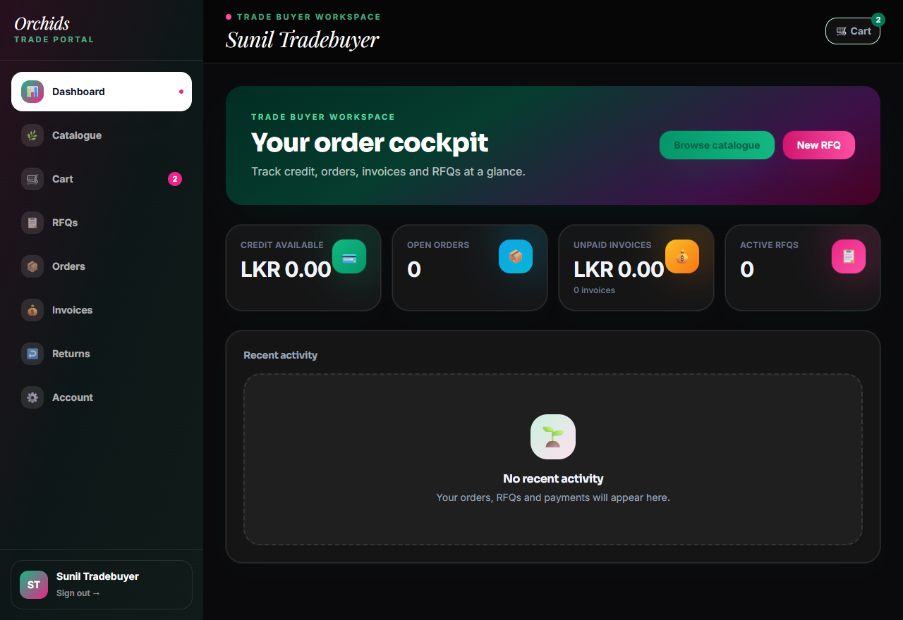
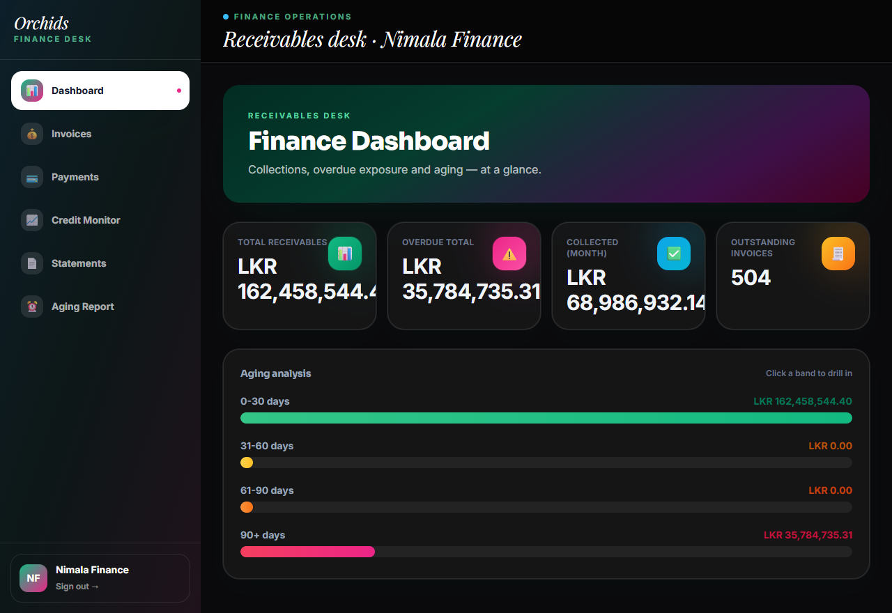

<div align="center">

# 🌸 K ORCHIDS — Project Green

### B2B Wholesale Orchid Trade Platform

A full-stack wholesale commerce platform for a Sri Lankan orchid exporter — RFQ → quote → order, tier pricing, credit & invoicing, payments, returns (RMA), delivery tracking, and a dark glassmorphism UI.


</div>

---

## ✨ Overview

Project Green is a monorepo B2B platform with **five role-based portals** (Admin, Trade Buyer, Inventory, Finance, Delivery) over a single Express API and a 38-table PostgreSQL schema. It models the real wholesale lifecycle end-to-end with correct money handling, governed pricing, stock reservation under concurrency, and an append-only audit trail.

| | |
|---|---|
|  |  |
| Public catalogue | Admin operations dashboard |
|  |  |
| Buyer order cockpit | Finance receivables & aging |

---

## 🧩 Features by portal

- **Public** — landing (blooming-orchid video hero), live catalogue with trigram search, auth (login / register / verify / reset).
- **Trade Buyer** — catalogue, cart, RFQ → quote → order, orders, invoices, returns (RMA), statements, account.
- **Admin** — dashboard, buyer approvals & tiers, products CMS + images, pricing governance, RFQs, orders, RMA, deliveries, reports, CMS, users, security (sessions / login history / audit / price-history).
- **Finance** — invoices, partial payments + reversal, credit monitor, statements, aging buckets.
- **Inventory** — stock dashboard, products, movement ledger, low-stock alerts.
- **Delivery** — coordinator board (assign → dispatch → in-transit → delivered), POD upload, status events.

---

## 🛠 Tech stack

**Web** — Next.js 14 (App Router) · React · TailwindCSS · TanStack Query · Axios
**API** — Node.js · Express · PostgreSQL (`pg`) · Zod · JWT (access + rotating refresh) · bcryptjs · decimal.js · node-cron · Nodemailer · Cloudinary · Handlebars
**Tooling** — npm workspaces · custom migration runner · faker seed (pinned)

---

## 📁 Monorepo structure

```
apps/
  web/                 Next.js 14 front end
    app/(public|buyer|admin|finance|inventory|delivery)/   role portals
    src/lib            api client, auth, cart store
    src/components      ui / domain / layout / auth
  api/                 Express back end
    src/modules/<domain>/   <domain>.{routes,controller,service,repository,schema,test}.js
    src/middleware      auth, rbac, audit, validate, errors, rateLimit, request_id
    src/utils           money, stateMachine, pagination, time, outbox
    src/jobs            cron: outboxDispatch, invoiceAging, quoteExpiry, stockCheck, sessionSweep
    migrations/         0001 … 0009 (38 tables)
scripts/                migrate.js · seed.js · verify_fixes.js
docs/                   DATABASE.md · BUGFIX_PROOF.md · devlog.md · diagrams
```

---

## 🗄 Database

PostgreSQL 18 · **38 tables** · 9 migrations · full RBAC, state machines, and `SELECT … FOR UPDATE` stock reservation. See **[docs/DATABASE.md](docs/DATABASE.md)** for the full schema, ER diagram, role matrix, concurrency model, and edge cases.

---

## 🚀 Getting started

```bash
# 1. Postgres (create + migrate + seed)
createdb project_green
npm run migrate
npm run seed

# 2. API  → http://localhost:5000
cd apps/api && npm install && npm run dev

# 3. Web  → http://localhost:3000
cd apps/web && npm install && npm run dev
```

Environment: copy `apps/api/.env.example` → `apps/api/.env` and fill in `DATABASE_URL`, `JWT_SECRET`, SMTP and Cloudinary keys.

### Demo accounts (seeded)
| Role | Email | Password |
|---|---|---|
| Admin | `admin@example.invalid` | `Staff@1234` |
| Finance | `finance@example.invalid` | `Staff@1234` |
| Inventory | `inventory@example.invalid` | `Staff@1234` |
| Delivery | `delivery@example.invalid` | `Staff@1234` |
| Trade Buyer | `buyer1@example.invalid` | `Buyer@1234` |

---

## ✅ Quality & verification

- `node scripts/verify_fixes.js` → **11/11 green** (DB-independent checks of the core money / stock / RBAC / state-machine logic).
- DB & Security audit: **30/30 findings remediated** — see **[docs/BUGFIX_PROOF.md](docs/BUGFIX_PROOF.md)**.

---

## 🌿 Team — Group H

| Member | Role | Lead branch | GitHub |
|---|---|---|---|
| Sithum Nimhan | Backend Dev & QA | `feature/auth-rbac-accounts` | [@Sithum77](https://github.com/Sithum77) |
| Nadeera Prabhash | Software Engineer | `feature/catalogue-inventory` | [@darkgladiator77](https://github.com/darkgladiator77) |
| Yasali Sarajika | Frontend Dev & QA | `feature/rfq-cart-orders` | [@Yasali13](https://github.com/Yasali13) |
| Rashandi Tharushika | UI/UX & Docs Coord. | `feature/finance-invoices-rma` | [@rtwijendra](https://github.com/rtwijendra) |
| Ronith Rashmikara | Project Manager / DevOps | `feature/delivery-reports-platform` | [@InfiniteBloom-max](https://github.com/InfiniteBloom-max) |

---

## 🔀 Workflow

`main` (protected, releases) ← `develop` (integration) ← `feature/*` (one lead each). Conventional Commits; PR + review per [docs/CONTRIBUTING.md](docs/CONTRIBUTING.md). Build window: **30 Apr → 17 Jun 2026**. The [issues](https://github.com/InfiniteBloom-max/Project-Green-Orchids/issues?q=is%3Aissue) and merge history double as the contribution ledger.

---

<div align="center"><sub>© 2026 K ORCHIDS · Project Green · Group H · Built for academic assessment.</sub></div>
