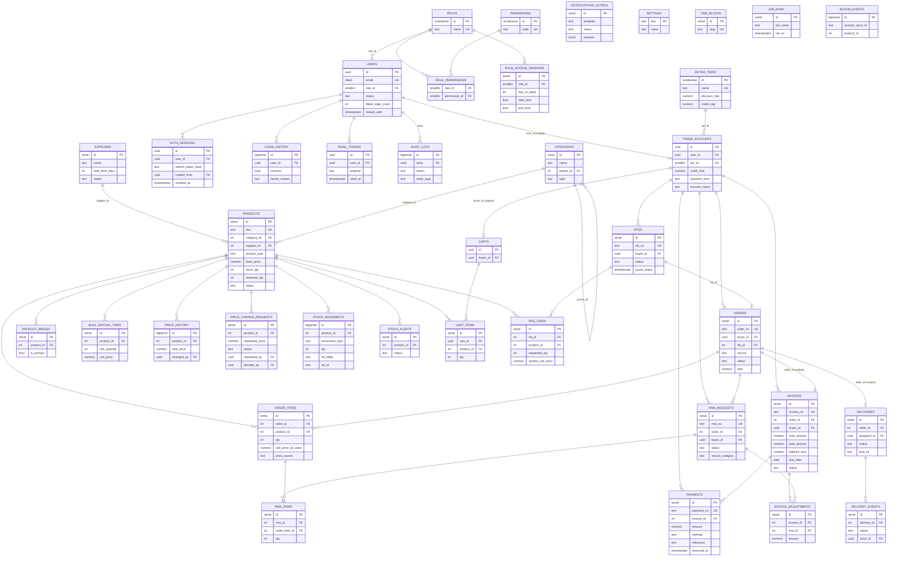

# Project Green (K ORCHIDS) — Database Reference

PostgreSQL 18 · **38 tables** · schema in `apps/api/migrations/0001`–`0009` · access layer in `apps/api/src/modules/<domain>/*.repository.js` · runner `scripts/migrate.js` · seed `scripts/seed.js`.

---

## 1. Foundation

- **Extensions** (`0001_extensions.sql`): `uuid-ossp` + `pgcrypto` (UUID PKs via `gen_random_uuid()`), `pg_trgm` (fuzzy/trigram search on product name + SKU), `citext` (case-insensitive emails).
- **Money** is `NUMERIC(12–14,2)` everywhere — never floating point. Arithmetic uses `decimal.js` in `utils/money.js`.
- **`updated_at`** on every mutable table, maintained by a shared `set_updated_at()` trigger.
- **Append-only ledgers** — `audit_logs`, `stock_movements`, `price_history` — `0008` `REVOKE`s UPDATE/DELETE from the app DB role.
- Identifiers: human-facing tables carry a unique business number (`order_no`, `invoice_no`, `payment_no`, `rfq_no`, `rma_no`) separate from the surrogate PK.

---

## 2. ER diagram

> Renders on GitHub / any Mermaid viewer. (Full-attribute version below; a relationship-only map is easier to skim.)

---

## 3. Roles & permissions (RBAC)

5 roles (`roles`), ~44 permissions (`permissions`), joined by `role_permissions` (`0002_roles_permissions.sql`). The JWT carries `roleId` + flattened `permissions[]`; `middleware/rbac.js` enforces via `requirePermission(...)` / `requireRole(...)`.

| Capability | ADMIN | TRADE_BUYER | INVENTORY_MGR | FINANCE_OFFICER | DELIVERY_COORD |
|---|:--:|:--:|:--:|:--:|:--:|
| View catalogue / stock | ✅ | ✅ view | ✅ | ✅ view | ✅ view |
| Create/edit products, adjust stock | ✅ | ❌ | ✅ | ❌ | ❌ |
| Change price / approve price change | ✅ | ❌ | ✅ | ❌ | ❌ |
| Create RFQ / order (own) | ✅ | ✅ | ❌ | ❌ | ❌ |
| Quote RFQ, approve/reject order | ✅ | ❌ | ❌ | ❌ | ❌ |
| Generate invoice, record/reverse payment | ✅ | ❌ | ❌ | ✅ | ❌ |
| View invoices | all | own only | ❌ | all | ❌ |
| Decide RMA (return) | ✅ | create only | ❌ | ✅ | ❌ |
| Assign/update delivery, upload POD | ✅ | ❌ | ❌ | ❌ | ✅ |
| Manage users / assign roles / view audit | ✅ | ❌ | ❌ | ❌ | ❌ |
| Edit CMS / settings | ✅ | ❌ | view | view | view |

**Restriction rules:**
- Buyers hold `*.view.own`, not `*.view.all` — every query is scoped to the caller's `trade_account` id, so buyer A can never see buyer B's data (services throw `403 FORBIDDEN` on mismatch).
- Separation of duty: placer ≠ approver (buyer places, admin approves); price changer may need a different admin to approve; finance handles money but not stock.
- Optional `role_access_windows` can limit a role's access to set days/times.

---

## 4. State machines (`utils/stateMachine.js`)

Guarded transitions; status names match the DB `CHECK` constraints exactly. Anything not listed → `409 INVALID_TRANSITION`; wrong role → `403 FORBIDDEN_TRANSITION`.

- **Order**: `PENDING_APPROVAL → APPROVED|REJECTED` (ADMIN) · `→ CANCELLED` (BUYER/ADMIN) · `APPROVED → DISPATCHED → DELIVERED` (ADMIN/DELIVERY) · `DELIVERED → CLOSED` (BUYER).
- **RFQ**: `SUBMITTED → UNDER_REVIEW → QUOTED` (ADMIN) · `QUOTED → ACCEPTED|REJECTED` (BUYER) · `QUOTED → EXPIRED` (SYSTEM/cron) · `ACCEPTED → CONVERTED`.
- **RMA**: `PENDING → APPROVED|REJECTED` (ADMIN/FINANCE) · `→ CANCELLED` (BUYER) · `APPROVED → RESOLVED`.
- **Delivery**: `PENDING → ASSIGNED → DISPATCHED → IN_TRANSIT → DELIVERED` (ADMIN/DELIVERY); `→ FAILED`; `DELIVERED → CONFIRMED` (BUYER).
- **Invoice**: SYSTEM-only (`PENDING → PARTIALLY_PAID → PAID`, `→ OVERDUE`, `→ ADJUSTED`) — driven by payment math, never hand-set.

---

## 5. Concurrency — "two people change the same thing at once"

Pessimistic row locks + re-validation inside a transaction + DB constraints as the last line of defence.

### A) Two admins approve orders competing for the same product's last stock
`orders.service.approve()` (in one `tx()`):
1. `SELECT … FOR UPDATE` on the product rows (`repo.lockProductsForUpdate`).
2. Recompute `available = stock_qty − reserved_qty` **after** the lock.
3. `available < qty` → `409 INSUFFICIENT_STOCK`.
4. Else bump `reserved_qty` + write `ORDER_RESERVE` to `stock_movements`.

Admin #2 **blocks** on the lock until #1 commits, re-reads the now-higher `reserved_qty`, and is rejected. Backstop: `products CHECK (reserved_qty <= stock_qty)` makes over-reservation impossible even with a logic bug.

### B) Two admins approve the *same* order
`invoices.order_id` is **`UNIQUE`** (one invoice per order). The second transaction's invoice insert violates it → full rollback. No duplicate reserve, no duplicate invoice.

### C) Double-click / duplicate payment
`0008` adds `UNIQUE (invoice_id, method, reference)` (`uq_payments_idempotent`) → duplicate is rejected, not double-charged. Reversal is non-destructive (`payments.reversed_at` + `reversal_reason`; row retained for audit).

### D) Credit race
Approval calls `repo.checkCredit()` in the same locked txn (`available = credit_limit − outstanding`) → `409 CREDIT_LIMIT_EXCEEDED`; two orders can't both consume the last credit.

### E) Sessions / logins
`auth_sessions` stores **hashed** refresh tokens with **rotation** (`rotated_from`) + a **session cap** (default 3). `users.failed_login_count` + `locked_until` → **lockout after 5 fails / 15 min**; `login_history` logs every attempt.

### F) Outbox pattern
Emails are enqueued into `notifications_outbox` **inside the business transaction**; `jobs/outboxDispatch.js` sends them later — never sent for a rolled-back txn, never lost for a committed one.

---

## 6. Uniqueness & integrity guards

- Unique: `users.email`, `order_no`, `invoice_no`, `payment_no`, `rfq_no`, `rma_no`, `products.sku`, `buyer_tiers.name`.
- `invoices.order_id` UNIQUE & `deliveries.order_id` UNIQUE → one invoice & one delivery per order.
- `carts.buyer_id` UNIQUE (one cart/buyer); `cart_items UNIQUE(cart_id, product_id)`; `bulk_pricing_tiers UNIQUE(product_id, min_quantity)`.
- `CHECK (> 0)` on quantities/prices; enum-like `CHECK` lists on every status / type / method / payment_term column.
- FKs enforce referential integrity; cascades only where safe (e.g. `order_items → orders`).

---

## 7. Business edge cases handled

- **Cart → order**: rejects empty cart, below-MOQ lines, inactive products, over-availability at submit; admin re-checks at approval (stock may have changed).
- **RFQ → order**: quoted unit price taken verbatim, **no tier discount stacked** (`price_source = 'RFQ_QUOTE'`); conversion emits availability warnings, admin is the stock gate.
- **Price governance**: 2 self-serve price changes / 24h; 3rd routes to `price_change_requests` (`PENDING → APPROVED|REJECTED`).
- **Cron jobs** (`jobs/`): `quoteExpiry`, `invoiceAging` (→ OVERDUE), `stockCheck` (raise `stock_alerts`), `sessionSweep`, `outboxDispatch`.
- **Returns**: RMA qty ≤ delivered qty; allowed within `settings.rma_window_days` (default 7).
- **Configurable `settings`**: lockout threshold/duration, session cap, low-stock default, quote expiry days, payment timeout, auto-cancel days.

---

## 8. Appendix — all 38 tables by migration

| Migration | Tables |
|---|---|
| `0001_extensions` | (extensions only: uuid-ossp, pgcrypto, pg_trgm, citext) |
| `0002_roles_permissions` | roles, permissions, role_permissions |
| `0003_users_auth` | users, auth_sessions, login_history, email_tokens, role_access_windows |
| `0004_trade_catalogue` | buyer_tiers, trade_accounts, suppliers, categories, products, product_images, bulk_pricing_tiers |
| `0005_pricing_rfq_cart_orders` | price_history, price_change_requests, rfqs, rfq_items, carts, cart_items, orders, order_items, stock_movements |
| `0006_invoices_payments_rma_delivery` | invoices, payments, invoice_adjustments, rma_requests, rma_items, deliveries, delivery_events |
| `0007_crosscutting` | audit_logs, notifications_outbox, settings, cms_blocks, stock_alerts, job_runs, bloom_events |
| `0008_indexes_constraints` | (indexes, deferred FKs, `uq_payments_idempotent`, grants, default settings seed) |
| `0009_reconciliation` | (alignment / reconciliation of constraints & enums) |
